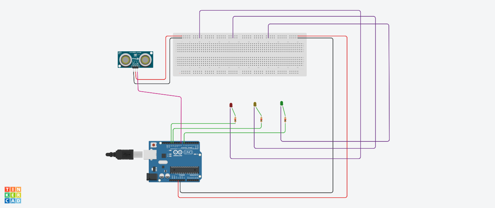

## DSL-Language-for-UltraSonic-Sensor
#DSL Code for Optimization and Use of UltraSonic Sensors in Arduino
 
 Através da utilização de módulos de sensores Ultra Sônicos em microcontroladores ARDUINO, é possível detectar obstáculos e médir distâncias. Foi proposta aqui um uma medição de distância por meio da utilização do Sensor de modelo Parallax PING para verficação de uma distância hipotética segura. Este tipo de método é bastante utilizado em sistemas de Estacionamento de veículos.
 
* Caso a distância ao objeto referêncial seja menor que 100 centrímetros (cm), o LED Vermelho é acesso, indicando que esta distância não é segura;
* Caso a distância ao objeto referêncial esteja entre 100 e 200 cm, o LED Amarelo é acesso, indicando que esta distância ainda não é a ideal;
* Caso a distância ao objeto referêncial seja maior que 200 cm, o LED Verde é acesso, indicando que esta é uma distância segura.
 
 O código utilizado neste projeto esta disponível no arquivo "ULTRASONIC_LEDS", presente na pasta "codes".
 
 Abaixo segue imagem do protótipo:
 

Componentes utilizados:

Componente| Quantidade 
------------- |------------- |
 Sensor de Distância Ultra Sônico| 01   
 Arduino Uno R3 | 01
 LED Vermelho | 01
 LED Amarelo | 01
 LED Verde | 01
 Resistor 1 kohm | 03
 

